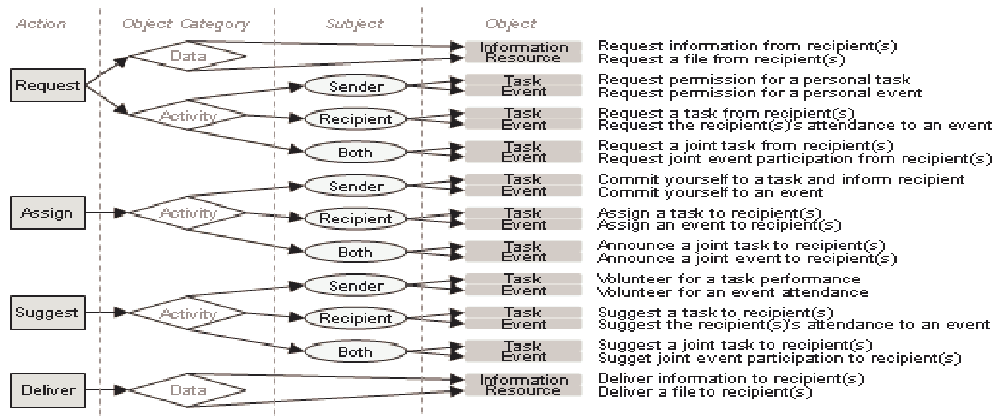

# EmailClassification
Create order where chaos reigns, your inbox ;)


Isolated downloader demonstration steps:

1. install Anaconda's `Miniconda` console tool for minimalistic footprint virtual environment manager.
   * go to...
      *  https://docs.conda.io/en/latest/miniconda.html
   * choose your installation process and follow the docs they provide.
2. launch the resulting conda terminal (In windows this is a specific powershell/cmd terminal, this may vary on \*nix systems)
3. clone this repository to your local machine, then cd into that cloned directory.
   * the contents should look something like:
```
|- EmailClassification
	|- Presentation_resources
		|- ignorable stuffs for now
	|- src
		|- code files and stuff...
	|- .gitignore
	|- downloader_environment.yml 	# this environment file gives minimal footprint for downloading and caching emails.
	|- environment.yml     			# this environment file is for full classification pipeline
	|- README.md
	|- setup.py
```
4. use conda to set up and activate your virtual environment.
   * ` conda env create -f ./downloader_environment.yml`
   * `conda activate email_downlaoder_env`
      * optionally, you may inspect the packages available in the environment as follows:
         * `conda env export`
            * gives a verbose listing of packages and their versions
         * or you can call `conda env export --from-history`
            * This will tell you explicitly what the `downloader_environment.yml` file required.
5. Sanity check:
   * You should be in a conda activated terminal, inside of the `email_downlaoder_env` virtual environment.
   * You should also be in the `EmailClassification` folder, which is the root of the project, 
   * The `setup.py` file should also be in the `EmailClassification` folder.
6. Now we have `pip` use the `setup.py` file to modify the environment.
   * ` python -m pip install -e .`
      * tells python to run pip install with the `-e` flag that signals to use a local `setup.py` file.
      * we pass `.` to say that the `setup.py` file is located in the current working directory.
   * This will result in the creation of console entry-points to the program for easy command line interactions.
   * output should look something like this:
```
	$ python -m pip install -e .
	Obtaining file:///D:/GitHub_Remotes/shcool/EmailClassification
	Installing collected packages: EmailClassification
	  Running setup.py develop for EmailClassification
	Successfully installed EmailClassification
```
7. We can now call the downloader command line entry point `email_download` to get the default implementation of the downlaoder.
   	  * The default implementation will download from the hard-coded email server, targeting the hard-coded account and password, and will cache the downloaded emails in the `*/EmailClassification/cache_files/` folder,
      * Alternatively, you can call `email_download /path/to/your/desired/cache/point`
         * This custom cache directory will be created should it not already exist.
   * If you would like to manually inspect the entire list of entry points the `setup.py` file created, see the keyword `entry_points` at the bottom of the `setup.py` file.
      * This list is subject to change over time as further entry points are added.

Conceptual elements for possible classification tools:
===

### Speach Act Theory
This model is based on aspects of the Speech Act Theory (Searle, 1969), which states that every utterance implies an action by the speaker with varying effects on both the speaker and the hearer. When applied to electronic conversations, the sender and the recipient perform the roles of the speaker/hearer whereas textual phrases function as utterances. Action items in the model consist of three parameters:

* Action – what is being performed e.g. a request, a notification or an assignment
* Object – the object of the action e.g. a request for a meeting
* Subject – the subject/agent of the object if applicable e.g. who will/would attend the meeting

Actions consist of Request – an action requiring a reply from the recipient (e.g. a question); Assign – an action requiring an activity but no reply (e.g. an order or a commitment); Suggest – an action involving an optional activity; and Deliver – the action of delivering data. Objects are categorised into Activities (Task and Event) and Data (Information and Resource). The subject parameter is only applicable to activities (being the task performer(s) or the event participant(s) – i.e. Sender, Recipient, Both). See the figure bellow...


<figcaption>Figure 1: The 22 action item instances for the classification task, with a short description</figcaption>
